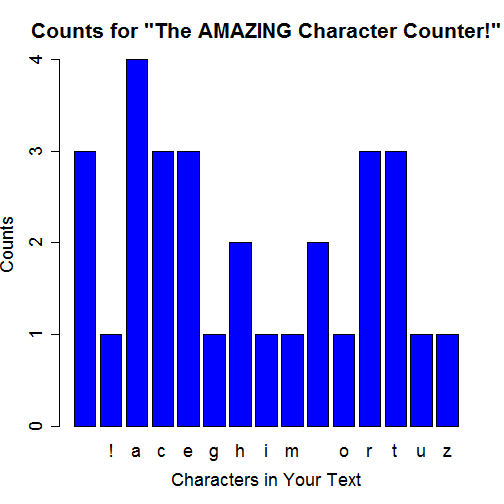

The AMAZING Character Counter!
========================================================
author: jayshill
date: January 25, 2015

What Does It Do?
========================================================

What do you think it does? It counts characters!

It slices! It dices! It... puts things in order?

```r
# Convert to all lower case
entryLower <- tolower("The AMAZING Character Counter!")
# Split into individual charcters
splitEntry <- strsplit(entryLower, split="")[[1]]
# Find the unique characters
uniqueChar <- sort(unique(splitEntry))
uniqueChar
```

```
 [1] " " "!" "a" "c" "e" "g" "h" "i" "m" "n" "o" "r" "t" "u" "z"
```


But Why?
========================================================

Because who has time to count and plot all the letters and numbers they type?

```r
# Tabulate the number of appearances of each character
charDist <- as.data.frame(sapply(uniqueChar, function(x) {
    length(grep(x, splitEntry))
    }))
```

So, What Does It Look Like?
========================================================

 


Where Can I Find This AMAZING App?
========================================================
On the internets, of course!

Go to this link and try it for yourself:
https://jshcoursera.shinyapps.io/CharacterCounter/

Hours and hours of entertainment, and all for FREE!
